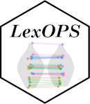
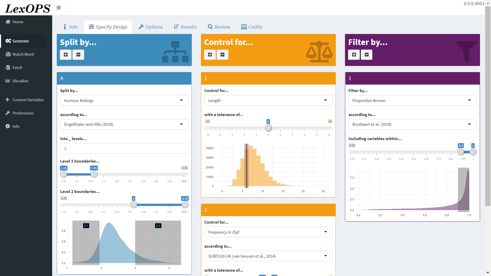
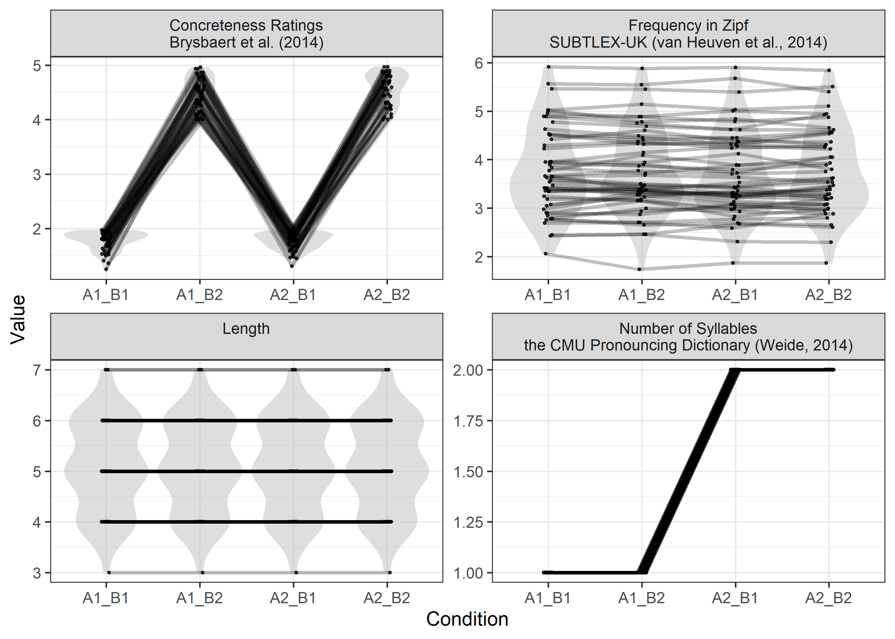

<!-- README.md is generated from README.Rmd. Please edit that file -->

# LexOPS 

<!-- badges: start -->

[](https://www.tidyverse.org/lifecycle/#stable)
[]()
<!-- badges: end -->

LexOPS is an R package for generating word stimuli, for use in
Psychology experiments. It can generate stimuli for a factorial design
specified by the user, controlling for selected lexical variables. The
package has an inbuilt database of features for English words
(`LexOPS::lexops`), but the user can also use their own list of
features, for English words and/or for words in other languages.

## Installation

LexOPS can be installed as an R package with:

``` r
if (!require("devtools")) install.packages("devtools")
devtools::install_github("JackEdTaylor/LexOPS@*release")
```

## Walkthrough

An in-depth walkthrough of the package is available here:

<https://jackedtaylor.github.io/LexOPSdocs/>

## TL;DR

### Shiny App

The package features an interactive shiny app, with several useful
features such as visualising variables’ distributions and relationships
while generating stimuli. It’s a friendly front-end to the functions
detailed below. The LexOPS shiny app is available online at
<https://jackt.shinyapps.io/lexops/>, but it is usually faster and more
relilable to run it locally, with:

``` r
LexOPS::run_shiny()
```



### Code

LexOPS’ functions allow you to easily generate stimuli in a reproducible
way.

#### The “Generate Pipeline”

The following example pipeline generates 50 words (all nouns) per
condition (200 words in total), for a study with a 2 x 2, concreteness
(low, high) by bigram probability (low, high) experimental design. Words
are controlled for by length exactly, and by word frequency within a
tolerance of ±0.2 Zipf. Matches are generated relative to each condition
an equal number of times (`match_null="balanced"`).

``` r
library(LexOPS)

# generate stimuli
stim <- lexops %>%
  subset(PoS.SUBTLEX_UK == "noun") %>%
  split_by(BG.SUBTLEX_UK, 0.001:0.004 ~ 0.008:0.011) %>%
  split_by(CNC.Brysbaert, 1:2 ~ 4:5) %>%
  control_for(Zipf.SUBTLEX_UK, -0.2:0.2) %>%
  control_for(Length) %>%
  generate(n = 50, match_null = "balanced")
```

    #> Generated 5/50 (10%). 7 total iterations, 0.71 success rate.
    #> Generated 10/50 (20%). 13 total iterations, 0.77 success rate.
    #> Generated 15/50 (30%). 18 total iterations, 0.83 success rate.
    #> Generated 20/50 (40%). 24 total iterations, 0.83 success rate.
    #> Generated 25/50 (50%). 34 total iterations, 0.74 success rate.
    #> Generated 30/50 (60%). 44 total iterations, 0.68 success rate.
    #> Generated 35/50 (70%). 55 total iterations, 0.64 success rate.
    #> Generated 40/50 (80%). 65 total iterations, 0.62 success rate.
    #> Generated 45/50 (90%). 72 total iterations, 0.62 success rate.
    #> Generated 50/50 (100%). 85 total iterations, 0.59 success rate.

A preview of what was generated:

``` r
# create a table of the first 20 words (4 per row) as an example
stim %>%
  head(5) %>%
  knitr::kable()
```

| item\_nr | A1\_B1      | A1\_B2      | A2\_B1      | A2\_B2      | match\_null |
| -------: | :---------- | :---------- | :---------- | :---------- | :---------- |
|        1 | subjection  | nightlight  | literalism  | bandmaster  | A1\_B1      |
|        2 | idiocy      | keypad      | renown      | minnow      | A2\_B1      |
|        3 | quasi       | lapel       | angst       | shank       | A1\_B1      |
|        4 | smugness    | ammonium    | whomever    | derriere    | A1\_B1      |
|        5 | phraseology | racquetball | nonchalance | mountaintop | A2\_B2      |

#### Review Generated Stimuli

The `plot_design()` function produces a plot summarising the generated
stimuli.

``` r
plot_design(stim)
```



#### Convert to Long Format

The `long_format()` function makes it easy to convert generated stimuli
into long format.

``` r
# present the same 20 words as in the last table
long_format(stim) %>%
  head(20) %>%
  knitr::kable()
```

| item\_nr | condition | match\_null | string      | Zipf.SUBTLEX\_UK | Length | BG.SUBTLEX\_UK | CNC.Brysbaert |
| -------: | :-------- | :---------- | :---------- | ---------------: | -----: | -------------: | ------------: |
|        1 | A1\_B1    | A1\_B1      | subjection  |         1.695736 |     10 |      0.0037287 |          1.70 |
|        1 | A1\_B2    | A1\_B1      | nightlight  |         1.649978 |     10 |      0.0030758 |          4.93 |
|        1 | A2\_B1    | A1\_B1      | literalism  |         1.774917 |     10 |      0.0090696 |          1.57 |
|        1 | A2\_B2    | A1\_B1      | bandmaster  |         1.540834 |     10 |      0.0096045 |          4.25 |
|        2 | A1\_B1    | A2\_B1      | idiocy      |         2.466588 |      6 |      0.0020867 |          1.75 |
|        2 | A1\_B2    | A2\_B1      | keypad      |         2.367834 |      6 |      0.0026913 |          4.81 |
|        2 | A2\_B1    | A2\_B1      | renown      |         2.420012 |      6 |      0.0086858 |          1.68 |
|        2 | A2\_B2    | A2\_B1      | minnow      |         2.263937 |      6 |      0.0082544 |          4.84 |
|        3 | A1\_B1    | A1\_B1      | quasi       |         2.848024 |      5 |      0.0034945 |          1.73 |
|        3 | A1\_B2    | A1\_B1      | lapel       |         2.748814 |      5 |      0.0038931 |          4.56 |
|        3 | A2\_B1    | A1\_B1      | angst       |         3.047918 |      5 |      0.0106373 |          1.96 |
|        3 | A2\_B2    | A1\_B1      | shank       |         2.981293 |      5 |      0.0103729 |          4.18 |
|        4 | A1\_B1    | A1\_B1      | smugness    |         2.339188 |      8 |      0.0033250 |          1.96 |
|        4 | A1\_B2    | A1\_B1      | ammonium    |         2.339188 |      8 |      0.0035710 |          4.04 |
|        4 | A2\_B1    | A1\_B1      | whomever    |         2.227215 |      8 |      0.0083446 |          1.85 |
|        4 | A2\_B2    | A1\_B1      | derriere    |         2.275519 |      8 |      0.0104492 |          4.65 |
|        5 | A1\_B1    | A2\_B2      | phraseology |         2.057464 |     11 |      0.0032117 |          1.69 |
|        5 | A1\_B2    | A2\_B2      | racquetball |         1.841864 |     11 |      0.0036144 |          4.66 |
|        5 | A2\_B1    | A2\_B2      | nonchalance |         1.841864 |     11 |      0.0082801 |          1.81 |
|        5 | A2\_B2    | A2\_B2      | mountaintop |         1.899856 |     11 |      0.0093209 |          4.56 |
