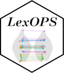
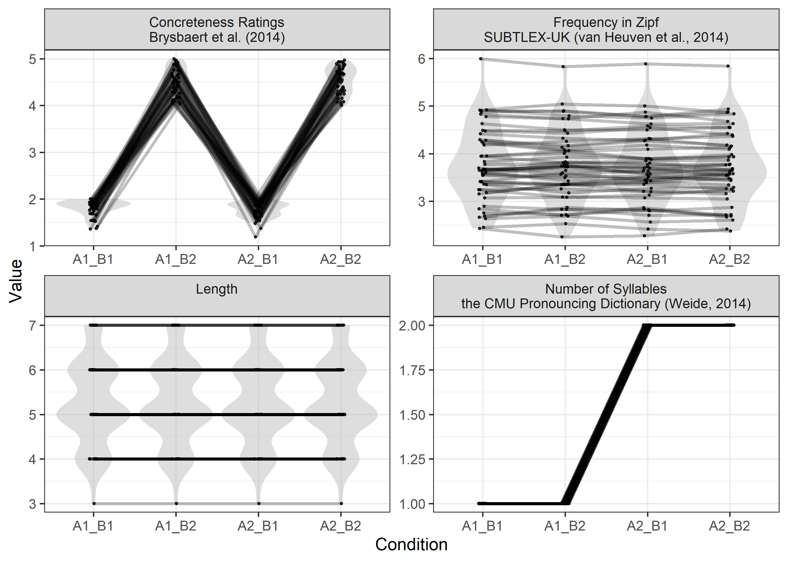
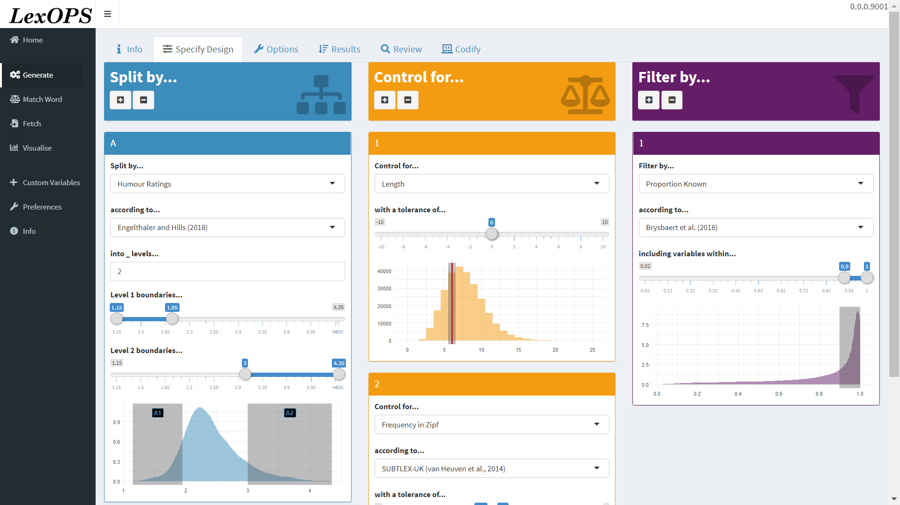

<!-- README.md is generated from README.Rmd. Please edit that file -->

# LexOPS 

<!-- badges: start -->

[](https://www.tidyverse.org/lifecycle/#stable)
[](https://github.com/JackEdTaylor/LexOPS/releases)
[](https://doi.org/10.3758/s13428-020-01389-1)
[](https://github.com/jackedtaylor/lexops/actions/workflows/R-CMD-check.yaml)
[](https://app.codecov.io/gh/jackedtaylor/lexops)
<!-- badges: end -->

LexOPS is an R package for generating matched stimuli for factorial
design experiments. You can use the functions on any dataframe, but
there is a database of example features for English words for
psycholinguistics studies in English (`LexOPS::lexops`).

## Installation

LexOPS can be installed as an R package with:

``` r
pak::pkg_install("JackEdTaylor/LexOPS@*release")
```

## How to Use

:book: In-depth walkthrough of the package:
<https://jackedtaylor.github.io/LexOPSdocs/>

:mortar_board: Paper about the package: [Taylor, Beith, and Sereno
(2020)](https://doi.org/10.3758/s13428-020-01389-1)

## TL;DR

LexOPS makes it easy to generate matched stimuli in a reproducible way.
The functions work on any dataframe, but there is an associated dataset,
`LexOPS::lexops`, containing psycholinguistic variables for English
words.

### The “Generate Pipeline”

The following example pipeline takes variables from the [lexops
dataset](https://github.com/JackEdTaylor/lexopsdata). It generates 50
words per condition (200 in total), for a study with a 2 x 2, syllables
(1, 2) by concreteness (low, high) design. Words are matched by length
exactly, and by word frequency within a tolerance of ±0.2 Zipf.

``` r
library(LexOPS)

stim <- lexops |>
  split_by(Syllables.CMU, 1:1 ~ 2:2) |>
  split_by(CNC.Brysbaert, 1:2 ~ 4:5) |>
  control_for(Length) |>
  control_for(Zipf.SUBTLEX_UK, -0.2:0.2) |>
  generate(n = 50, match_null = "inclusive")
```

    #> Generated 50/50 (100%). 245 total iterations, 0.20 success rate.

A preview of what was generated:

``` r
# show the first 5 rows of the output
stim |>
  head(5) |>
  knitr::kable()
```

| item_nr | A1_B1  | A1_B2  | A2_B1  | A2_B2  | match_null |
|--------:|:-------|:-------|:-------|:-------|:-----------|
|       1 | wits   | dent   | envy   | tuna   | NA         |
|       2 | heed   | curb   | duly   | lego   | NA         |
|       3 | whence | scythe | ardent | tomboy | NA         |
|       4 | whim   | quad   | edgy   | neon   | NA         |
|       5 | doomed | stance | beware | golfer | NA         |

### Review Generated Stimuli

The `plot_design()` function produces a plot summarising the generated
stimuli.

``` r
plot_design(stim)
```



### Convert to Long Format

The `long_format()` function coerces the generated stimuli into long
format.

``` r
# present the same 20 words as in the earlier table
long_format(stim) |>
  head(20) |>
  knitr::kable()
```

|  | item_nr | condition | match_null | string | Zipf.SUBTLEX_UK | Length | Syllables.CMU | CNC.Brysbaert |
|:---|---:|:---|:---|:---|---:|---:|---:|---:|
| 1 | 1 | A1_B1 | NA | wits | 3.697902 | 4 | 1 | 1.76 |
| 51 | 1 | A1_B2 | NA | dent | 3.569056 | 4 | 1 | 4.63 |
| 101 | 1 | A2_B1 | NA | envy | 3.636750 | 4 | 2 | 1.69 |
| 151 | 1 | A2_B2 | NA | tuna | 3.762807 | 4 | 2 | 4.89 |
| 2 | 2 | A1_B1 | NA | heed | 3.244739 | 4 | 1 | 1.93 |
| 52 | 2 | A1_B2 | NA | curb | 3.261583 | 4 | 1 | 4.68 |
| 102 | 2 | A2_B1 | NA | duly | 3.207619 | 4 | 2 | 1.68 |
| 152 | 2 | A2_B2 | NA | lego | 3.161119 | 4 | 2 | 4.73 |
| 3 | 3 | A1_B1 | NA | whence | 2.844955 | 6 | 1 | 1.88 |
| 53 | 3 | A1_B2 | NA | scythe | 2.704336 | 6 | 1 | 4.29 |
| 103 | 3 | A2_B1 | NA | ardent | 2.863053 | 6 | 2 | 1.64 |
| 153 | 3 | A2_B2 | NA | tomboy | 2.712769 | 6 | 2 | 4.25 |
| 4 | 4 | A1_B1 | NA | whim | 3.155128 | 4 | 1 | 1.69 |
| 54 | 4 | A1_B2 | NA | quad | 3.351834 | 4 | 1 | 4.07 |
| 104 | 4 | A2_B1 | NA | edgy | 3.354701 | 4 | 2 | 1.87 |
| 154 | 4 | A2_B2 | NA | neon | 3.269767 | 4 | 2 | 4.07 |
| 5 | 5 | A1_B1 | NA | doomed | 3.650942 | 6 | 1 | 1.88 |
| 55 | 5 | A1_B2 | NA | stance | 3.739098 | 6 | 1 | 4.04 |
| 105 | 5 | A2_B1 | NA | beware | 3.699627 | 6 | 2 | 2.00 |
| 155 | 5 | A2_B2 | NA | golfer | 3.543925 | 6 | 2 | 4.71 |

### Shiny App

The package has an interactive shiny app, which supports most code
functionality, with useful additional features like visualising
distributions and relationships. It’s a friendly front-end to the
package’s functions. A demo version of the LexOPS shiny app is available
online at <https://jackt.shinyapps.io/lexops/>, but it is faster and
more reliable to run it locally, with:

``` r
LexOPS::run_shiny()
```



### Matching on Custom Dataframes

As well as using the [lexops
dataset](https://github.com/JackEdTaylor/lexopsdata), you can generate
matches from any dataframe object.

Here is an example using `mtcars`. We pick five automatic and five
manual models of car, matched for acceleration (within ±5 `qsec`) and
the number of carburetor barrels (`carb`; exactly).

``` r
mtcars |>
  tibble::as_tibble(rownames = "car_id") |>
  set_options(id_col = "car_id") |>
  split_by(am, 0:0 ~ 1:1) |>
  control_for(qsec, -5:5) |>
  control_for(carb, 0:0) |>
  generate(5)
```

    #>   item_nr                A1            A2 match_null
    #> 1       1    Hornet 4 Drive    Datsun 710         A2
    #> 2       2       AMC Javelin   Honda Civic         A1
    #> 3       3  Dodge Challenger    Volvo 142E         A2
    #> 4       4     Toyota Corona     Fiat X1-9         A2
    #> 5       5 Hornet Sportabout Porsche 914-2         A1
